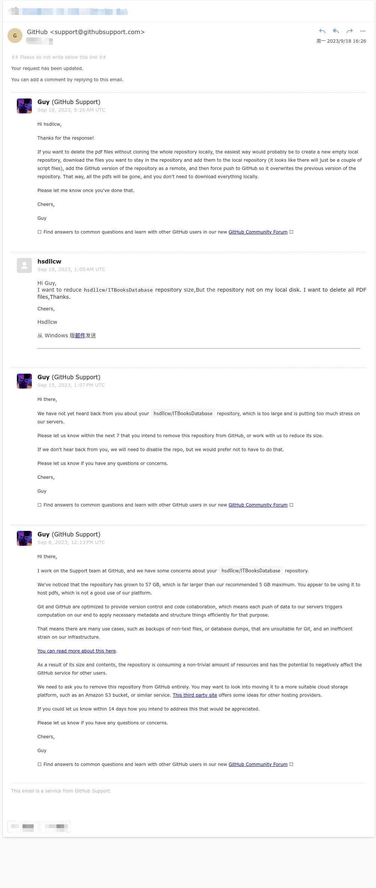

# ITBooksDatabase
收集IT方面的PDF书籍

### 该库已经删除
原因是收到了官方的警告邮件



```
Hi there,

I work on the Support team at GitHub, and we have some concerns about your hsdllcw/ITBooksDatabase repository.

We've noticed that the repository has grown to 57 GB, which is far larger than our recommended 5 GB maximum. You appear to be using it to host pdfs, which is not a good use of our platform.

Git and GitHub are optimized to provide version control and code collaboration, which means each push of data to our servers triggers computation on our end to apply necessary metadata and structure things efficiently for that purpose.

That means there are many use cases, such as backups of non-text files, or database dumps, that are unsuitable for Git, and an inefficient strain on our infrastructure.

You can read more about this here.

As a result of its size and contents, the repository is consuming a non-trivial amount of resources and has the potential to negatively affect the GitHub service for other users.

We need to ask you to remove this repository from GitHub entirely. You may want to look into moving it to a more suitable cloud storage platform, such as an Amazon S3 bucket, or similar service. This third party site offers some ideas for other hosting providers.

If you could let us know within 14 days how you intend to address this that would be appreciated.

Please let us know if you have any questions or concerns.

Cheers,

Guy

🪲 Find answers to common questions and learn with other GitHub users in our new GitHub Community Forum 🪲
```

数据库不会备份

# 再见